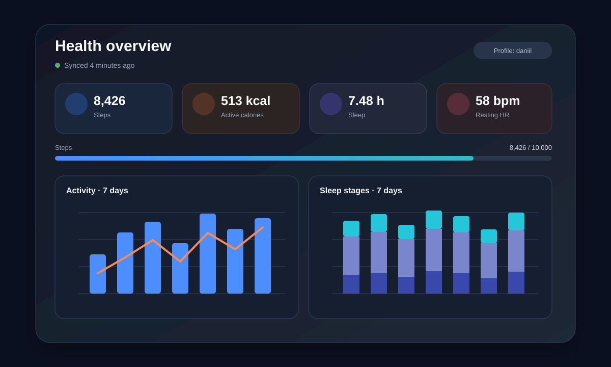

[English version](README.md)

# Health Bridge Dashboard Card



Адаптивная карточка Home Assistant без внешних зависимостей для интеграции
[Health Bridge](https://github.com/gregt1993/Health_Bridge). Она автоматически
находит сенсоры Health Bridge и показывает основные показатели здоровья,
прогресс дневной цели по шагам, последнюю тренировку и графики активности, сна
и пульса на основе истории Recorder.

Карточка содержит русскую и английскую локализацию и не требует ApexCharts,
Mushroom, card-mod или других дополнений интерфейса.

> Это независимый проект сообщества, не связанный с авторами Health Bridge или
> Health Assistant Link.

## Возможности

- Автоматическое определение профиля и сенсоров
- Компактная раскладка, адаптирующаяся к ширине карточки в режимах Masonry и Sections
- Показатели активности, сна, сердечно-сосудистой системы и состава тела
- Аккордеон активности и пульса с одинаковой адаптивной высотой графиков
- Стабильные отдельные шкалы шагов и активных калорий
- Пунктирная линия пульса в стиле кардиограммы, центральная опорная линия и отдельные точки измерений
- Нативный графический редактор Home Assistant с выбором сущностей
- График активности за 7 дней
- Составной график фаз сна
- График пульса за 24 часа
- Настраиваемая цель по шагам и видимость разделов
- Открытие стандартного окна Home Assistant по нажатию на показатель
- Ручная привязка переименованных сенсоров
- Поддержка цветов активной темы Home Assistant

## Требования

- Home Assistant 2024.11 или новее
- [Health Bridge](https://github.com/gregt1993/Health_Bridge) хотя бы с одной выполненной синхронизацией
- Включённая история Recorder для построения графиков
- HACS для рекомендуемого способа установки

## Установка через HACS как пользовательский репозиторий

[](https://my.home-assistant.io/redirect/hacs_repository/?owner=BrainDeLook&repository=health-bridge-dashboard-card&category=plugin)

Если кнопка недоступна:

1. Откройте **HACS** в Home Assistant.
2. Откройте меню с тремя точками и выберите **Пользовательские репозитории**.
3. Добавьте `https://github.com/BrainDeLook/health-bridge-dashboard-card`.
4. Выберите категорию **Dashboard**.
5. Загрузите **Health Bridge Dashboard Card**.
6. Обновите страницу браузера. При необходимости один раз очистите кэш интерфейса.

Для установки через пользовательский репозиторий не требуется ждать добавления
карточки в стандартный каталог HACS.

## Добавление карточки

Добавьте на панель Home Assistant карточку **Вручную**:

```yaml
type: custom:health-bridge-dashboard-card
```

Пример с русским интерфейсом и основными настройками:

```yaml
type: custom:health-bridge-dashboard-card
title: Здоровье
language: ru
days: 7
step_goal: 10000
calorie_goal: 600
show_activity: true
show_sleep: true
show_heart_rate: true
show_body: true
```

Карточка автоматически использует первый найденный профиль Health Bridge. Если
данные в один Home Assistant отправляют несколько человек, укажите суффикс
сенсоров:

```yaml
type: custom:health-bridge-dashboard-card
user_id: daniil
```

Для сущности `sensor.steps_daniil` значением `user_id` будет `daniil`.

## Настройки

| Параметр | Тип | По умолчанию | Описание |
|---|---:|---:|---|
| `title` | строка | локализовано | Заголовок карточки |
| `language` | `en` или `ru` | язык HA | Язык интерфейса |
| `user_id` | строка | автоматически | Суффикс сущностей профиля Health Bridge |
| `days` | число | `7` | История активности и сна: от 2 до 31 дня |
| `step_goal` | число | `10000` | Дневная цель по шагам |
| `calorie_goal` | число | `600` | Цель активных калорий и шкала графика |
| `show_activity` | boolean | `true` | График активности |
| `show_sleep` | boolean | `true` | График фаз сна |
| `show_heart_rate` | boolean | `true` | График пульса за 24 часа |
| `show_body` | boolean | `true` | Показатели состава тела |
| `entities` | mapping | `{}` | Ручное сопоставление показателей и сущностей |

## Графический редактор

Откройте редактор панели и выберите **Редактировать карточку**, чтобы настроить
её без YAML. Нативная форма Home Assistant позволяет изменить язык, период
истории, дневные цели и видимые разделы. В раскрываемом разделе **Сущности
показателей** можно выбрать любой сенсор Home Assistant для каждого значения.
Так можно объединять показатели разных людей, интеграций или сущности с другого
сервера умного дома, предварительно добавленные в текущий Home Assistant.

График активности использует две стабильные оси, потому что шаги и килокалории
являются разными единицами: шаги масштабируются относительно `step_goal` слева,
а активные калории — относительно `calorie_goal` справа. График пульса использует
все записанные изменения за последние 24 часа и показывает предыдущие измерения
BPM отдельными точками. Если Recorder ещё не вернул предыдущие значения, карточка
дополнительно запоминает изменения пульса, увиденные во время работы панели. При
переходе между измерениями пунктирная линия удерживает предыдущее значение, а
затем мягко переходит на новый уровень в стиле кардиограммы — без прямых
отрезков от точки к точке. В центре графика постоянно находится дополнительная
пунктирная опорная линия. При единственном значении линия остаётся горизонтальной
и отображается вместе с числовой меткой.

При первом запуске открыт график активности, а график пульса закрыт. Оба
заголовка работают как один переключатель: нажатие на любую стрелку меняет
активность на пульс или пульс на активность. Один из этих графиков всегда
остаётся открытым. Последний выбор запоминается отдельно для каждого профиля.

Пример с переименованными сущностями:

```yaml
type: custom:health-bridge-dashboard-card
entities:
  steps: sensor.my_steps
  heart_rate: sensor.my_heart_rate
  sleep_duration: sensor.my_sleep
```

## Поддерживаемые показатели Health Bridge

Карточка использует только доступные сенсоры. Отсутствующие показатели
автоматически скрываются.

- Активность: шаги, дистанция, активные калории, время тренировки, последняя тренировка
- Сон: общая продолжительность, глубокий, основной и REM-сон
- Сердце и дыхание: пульс, пульс в покое, HRV, SpO₂, частота дыхания
- Состав тела: вес, процент жира, безжировая масса, VO₂ max, кардиовосстановление
- Состояние: время последней синхронизации Health Bridge

## Решение проблем

### Карточка сообщает, что сенсоры не найдены

Выполните хотя бы одну синхронизацию Health Assistant Link. Затем откройте
**Инструменты разработчика → Состояния** и убедитесь, что существует сущность
вида `sensor.steps_<user_id>`. Для переименованных сущностей задайте `entities:`
вручную.

### Значения отображаются, но графики пустые

Для графиков требуется история Home Assistant Recorder. Убедитесь, что нужные
сенсоры не исключены из Recorder, и дождитесь накопления истории.

### Health Bridge используют несколько человек

Укажите отдельный `user_id` в каждой карточке. Это часть идентификатора сущности,
которая находится после названия показателя.

## Разработка

Готовая карточка написана на обычном JavaScript и не требует сборки:

```text
dist/health-bridge-dashboard-card.js
```

Проверка синтаксиса:

```bash
node --check dist/health-bridge-dashboard-card.js
```

## Лицензия

[MIT](LICENSE)
